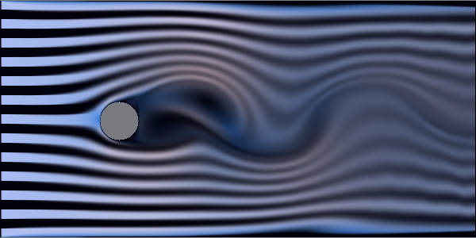

# VortexStreet

2D lattice Boltzmann fluid simulation: channel flow past a cylinder with a
Kármán vortex street, dye advection, mouse-drawn obstacles.



## Physics

D2Q9 lattice: nine velocity directions per cell. Each step is two local
operations — collision (relax the distribution functions toward local
equilibrium) and streaming (move them to neighboring cells). Pressure,
viscosity and the full nonlinear flow behavior emerge from these rules;
no Poisson solve, no global coupling, which is why LBM parallelizes so well.

Two collision operators, switchable at runtime:

- **BGK**: single relaxation rate `omega`; viscosity `nu = (1/omega - 0.5)/3`.
  Simple, fast, unstable at low viscosity.
- **MRT** (multiple relaxation time, Lallemand & Luo): distributions are
  transformed into moment space (density, energy, momentum, heat flux, stress),
  each moment relaxes at its own rate, `s_nu = omega` sets the viscosity.
  The moment matrix is orthogonal, so the inverse is a scaled transpose.
  Same physics, much better stability — stays sane near `omega = 1.99`,
  i.e. noticeably higher Reynolds numbers.

Boundaries: half-way bounce-back solids, fixed-equilibrium inlet,
zero-gradient outlet. A passive dye field is advected semi-Lagrangian through
the velocity field and injected in stripes at the inlet.

## Controls

| Control | Effect |
|---|---|
| Collision | BGK / MRT |
| Omega | relaxation rate (viscosity) |
| Inflow u0 | inlet speed, lattice units |
| Steps/frame | simulation speed |
| View | dye / speed / vorticity / density |
| LMB / RMB | draw / erase obstacles |
| Reset flow + cylinder | restore the default scene |

Live Reynolds number (`Re = u0 · D / nu`) and ms/step in the status panel.

## Build

```
cmake -B build -DCMAKE_BUILD_TYPE=Release
cmake --build build -j
```

Requires Qt6. C++17, Qt6 Widgets only, multithreaded on `std::thread`.

## Debug frame dump

`DUMP_FRAMES=N` renders N frames headlessly, saves `dump.png`, exits.

## License

MIT License

Copyright (c) 2026 Mykhailo Makarov

Permission is hereby granted, free of charge, to any person obtaining a copy
of this software and associated documentation files (the "Software"), to deal
in the Software without restriction, including without limitation the rights
to use, copy, modify, merge, publish, distribute, sublicense, and/or sell
copies of the Software, and to permit persons to whom the Software is
furnished to do so, subject to the following conditions:

The above copyright notice and this permission notice shall be included in all
copies or substantial portions of the Software.

THE SOFTWARE IS PROVIDED "AS IS", WITHOUT WARRANTY OF ANY KIND, EXPRESS OR
IMPLIED, INCLUDING BUT NOT LIMITED TO THE WARRANTIES OF MERCHANTABILITY,
FITNESS FOR A PARTICULAR PURPOSE AND NONINFRINGEMENT. IN NO EVENT SHALL THE
AUTHORS OR COPYRIGHT HOLDERS BE LIABLE FOR ANY CLAIM, DAMAGES OR OTHER
LIABILITY, WHETHER IN AN ACTION OF CONTRACT, TORT OR OTHERWISE, ARISING FROM,
OUT OF OR IN CONNECTION WITH THE SOFTWARE OR THE USE OR OTHER DEALINGS IN THE
SOFTWARE.

## Support

If you found this project interesting or useful, you can support my work:

[](https://github.com/sponsors/makarov-mm)